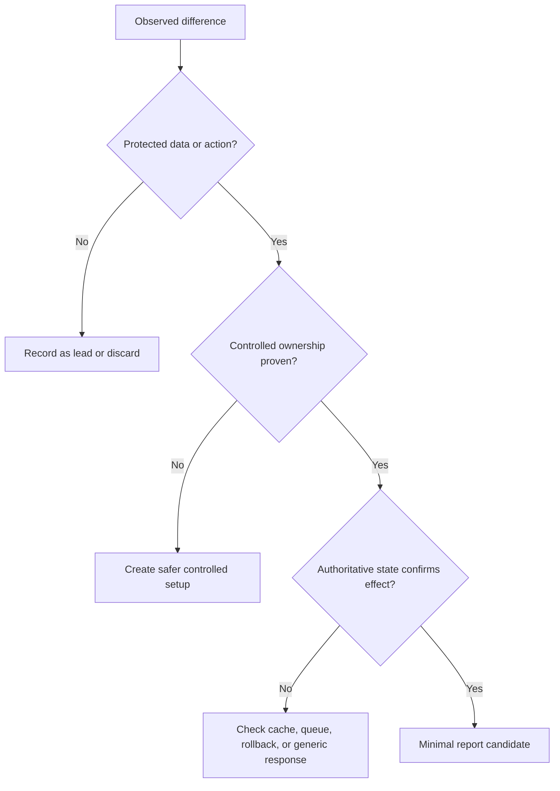

# Webhooks & Integrations

## Table of Contents

- [Security Rule](#security-rule)
- [Threat Model](#threat-model)
- [Attack Surface](#attack-surface)
- [Prerequisites](#prerequisites)
- [Testing Workflow](#testing-workflow)
- [Test Matrix](#test-matrix)
- [HTTP Example](#http-example)
- [Decision Tree](#decision-tree)
- [False Positives](#false-positives)
- [Impact](#impact)
- [Report Example](#report-example)
- [Remediation](#remediation)
- [References](#references)

## Security Rule

Inbound events must be authentic and replay-safe; outbound integrations must reach approved destinations with least privilege.

## Threat Model

Review signature verification, replay, destination validation, event authorization, retries, secrets, and third-party trust. Define attacker role, controlled victim role, trusted component, protected object, and authoritative state before changing traffic. Client-side restrictions, opaque identifiers, and unusual responses are signals, not security boundaries.

A useful hypothesis names a relationship: actor, action, object, tenant, state, channel, and time. Test one relationship at a time. Stop when proof would require real-user data, production disruption, or an out-of-scope service.

## Attack Surface

Map entry points from official traffic and documentation:

- synchronous web and API requests;
- background jobs, imports, exports, and notifications;
- browser, mobile, and integration clients;
- administrative, recovery, sharing, and deletion paths;
- parsing, normalization, storage, cache, and delivery layers.

Record which component makes the final security decision. A gateway response may differ from application state; a successful API response may be rolled back by a worker.

## Prerequisites

Use systems you own or have explicit permission to test. Prepare controlled accounts, unique test records, clean browser profiles, private evidence storage, and a written stop condition. Use a local lab for destructive parser, load, persistence, or shell behavior.

## Testing Workflow

1. Capture one known-good operation from an official client.
2. State expected security rule in one sentence.
3. Identify authoritative object or state after operation.
4. Change one actor, object, field, origin, state, channel, or timing variable.
5. Repeat with a fresh controlled record.
6. Compare stable response markers and final state.
7. Rule out caching, stale sessions, UI-only changes, and generic errors.
8. Keep smallest repeatable proof and redact credentials.

## Test Matrix

| Dimension | Baseline | Controlled variation | Evidence |
| :--- | :--- | :--- | :--- |
| actor | authorized account A | account B or lower role | protected field/action |
| object | A-owned test object | B-owned equivalent | owner-visible state |
| state | normal state | revoked, expired, archived | authoritative state |
| channel | official web flow | official API/mobile path | same security rule |
| time | sequential request | safe retry or expiry | timestamped timeline |

## HTTP Example

Reserved names and redacted values only:

```http
GET /api/webhooks-integrations/objects/OBJECT_B HTTP/1.1
Host: api.example.test
Authorization: Bearer <USER_A_TOKEN>
Accept: application/json
```

```http
HTTP/1.1 403 Forbidden
Content-Type: application/json

{"error":"forbidden","request_id":"REQ-123"}
```

For a write test, use a harmless marker and verify from owner B:

```http
PATCH /api/webhooks-integrations/objects/OBJECT_B HTTP/1.1
Host: api.example.test
Authorization: Bearer <USER_A_TOKEN>
Content-Type: application/json

{"note":"CONTROLLED-MARKER-7F3A"}
```

An echoed marker is not enough. Confirm stored state through the legitimate owner or authoritative read path.

## Decision Tree



## False Positives

- status, timing, or length differs but protected content does not;
- response echoes input without storing or executing it;
- stale session or cached page belongs to same controlled user;
- frontend hides a feature while backend policy correctly denies it;
- documentation, sample values, or public identifiers resemble secrets;
- behavior is expected and explicitly documented by program policy.

## Impact

Classify only proven effect:

| Level | Typical evidence |
| :--- | :--- |
| informational | implementation detail without boundary failure |
| low | limited non-sensitive controlled information |
| medium | cross-user read/change with constrained prerequisites |
| high | durable identity, tenant, sensitive-data, or privileged-action impact |
| critical candidate | broad compromise proven safely; coordinate immediately |

## Report Example

```markdown
# [Actor] can [action] [controlled object] across [boundary]

## Summary
[Endpoint or flow] fails to enforce [security rule]. Account A can affect
controlled object B by changing [single variable].

## Reproduction
1. Create equivalent controlled objects under A and B.
2. Capture the authorized baseline.
3. Replace [variable] with B's controlled value.
4. Verify [authoritative state] from B.

## Expected impact
State confirmed capability, prerequisites, scope, and unverified limits.
```

## Remediation

Enforce policy at authoritative server boundary, normalize input once, reject ambiguous forms, bind every nested object and asynchronous job to actor and tenant, minimize privilege, rotate exposed authority, and add negative regression tests for each matrix dimension.

## References

- [OWASP Web Security Testing Guide](https://owasp.org/www-project-web-security-testing-guide/)
- [OWASP Cheat Sheet Series](https://cheatsheetseries.owasp.org/)
- [PortSwigger Web Security Academy](https://portswigger.net/web-security/all-topics)
- [MITRE CWE](https://cwe.mitre.org/)

---

## Chapter Navigation

[Previous: GraphQL](graphql.md) · [Back to README](../README.md) · [Next: OAuth & OpenID Connect Techniques](oauth-techniques.md)
