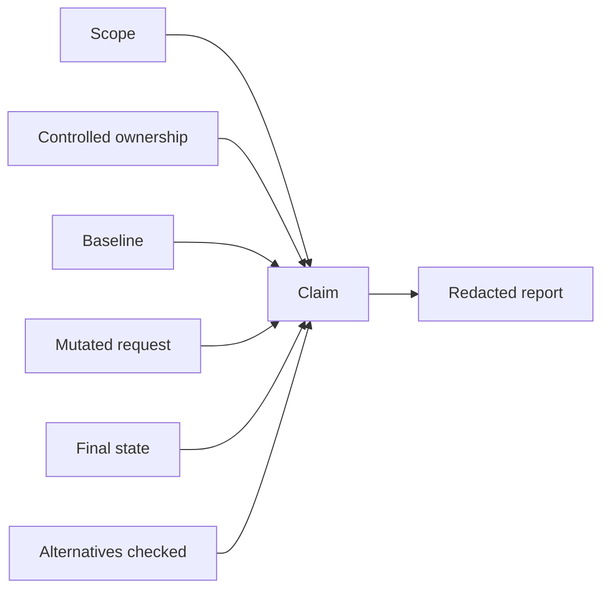

# Evidence Graph

A finding is a claim connected to scope, controlled ownership, baseline, mutated exchange, authoritative effect, false-positive checks, and cleanup. Orphan claims fail validation.

Evidence files stay private. Commit only synthetic examples and hashes.
