# Agent-Ready Bug Hunting Methodology

This layer defines one reusable process. Technique playbooks add only topic-specific prerequisites, mutations, confirmation rules, and stop conditions.

```mermaid
flowchart LR
  A[Engagement gate] --> B[Normalize scope]
  B --> C[Map surface]
  C --> D[Generate hypothesis]
  D --> E[Capture baseline]
  E --> F[Controlled variation]
  F --> G[Verify authoritative effect]
  G --> H[Check alternatives]
  H --> I[Score confidence]
  I --> J[Report or discard]
```

Follow chapters in numeric order. Agent state transitions are enforced by `agent/state-machine.json`.
