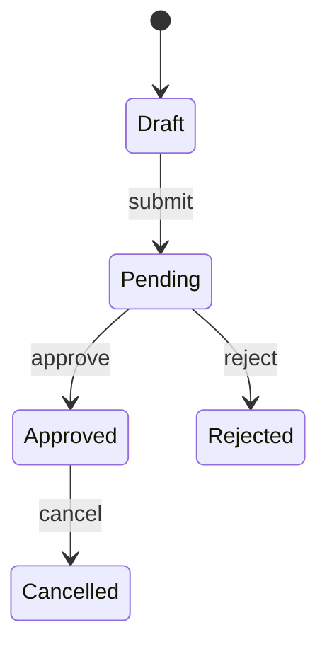

# Business Logic State Machine

## Invariants

- Who may trigger each transition?
- Which transitions are irreversible?
- Which values are server-authoritative?
- What happens on replay, retry, or concurrency?
